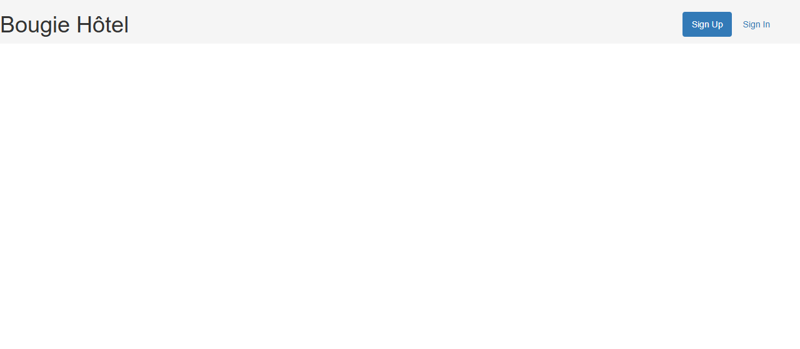
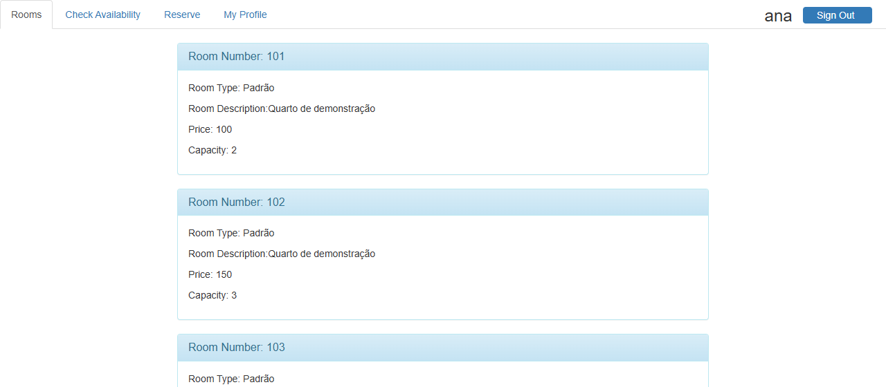
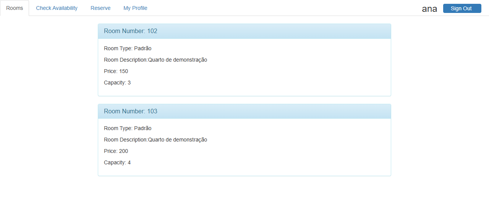
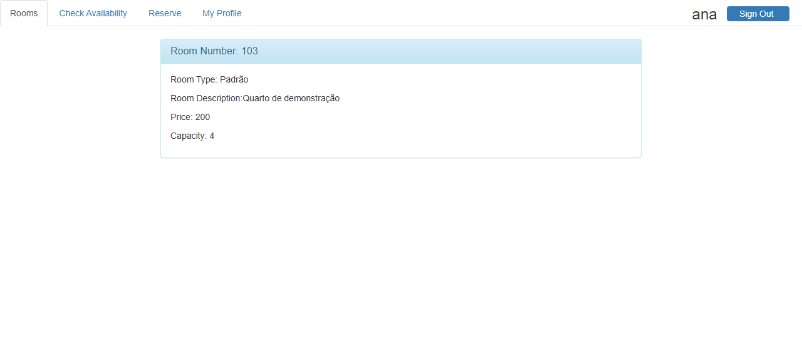
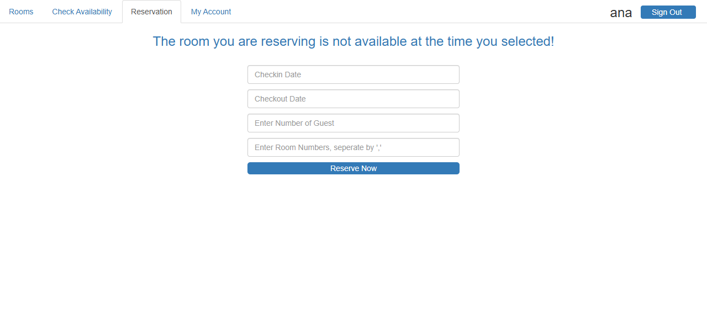
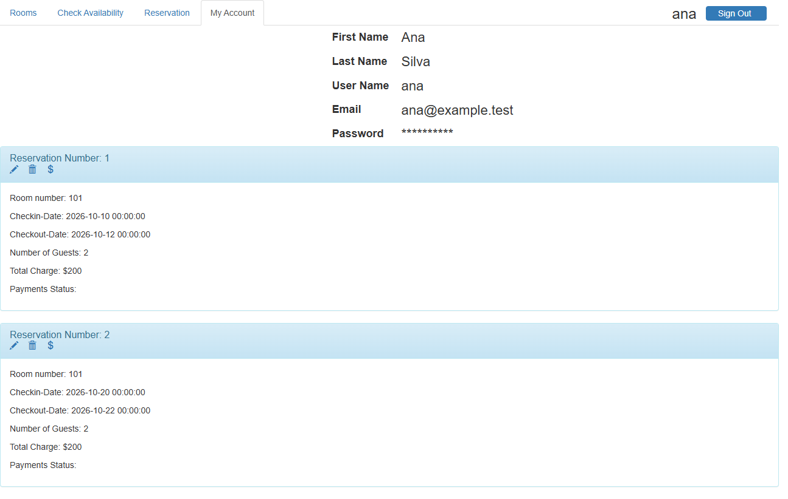
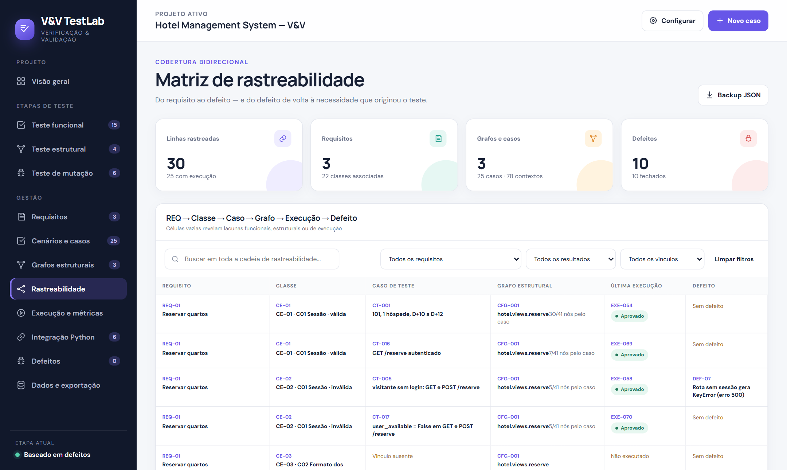

# Teste de software de terceiros: Hotel Management System

- **Aluno:** Gabriel Felipe Jess Meira
- **Disciplina:** Verificação e Validação
- **Sistema sob teste (SUT):** [CrystalWang1225/Hotel_Management_System](https://github.com/CrystalWang1225/Hotel_Management_System), commit `71b396bab15a840deab61a05d5c762173e8ea410`
- **Fork com testes e correções:** https://github.com/gabrielfjm/Hotel_Management_System (tags `upstream-71b396b`, `sut-original`, `sut-corrigido`)
- **Ferramentas:** pytest 8.4.2, coverage.py via pytest-cov 6.3.0, Cosmic Ray 8.4.3, radon 6.0.1, pygount 3.1.0

## Sumário executivo

As três técnicas foram aplicadas na ordem exigida (**funcional → estrutural → baseada em defeitos**) sobre os três requisitos principais do sistema, todos ligados à reserva de quartos: **REQ-01 Reservar quartos**, **REQ-02 Data de entrada** e **REQ-03 Data de saída**. Os demais requisitos funcionais foram catalogados (seção 1.2). A suíte final tem **25 casos**: 15 funcionais, 4 estruturais e 6 criados na etapa de mutação.

| Etapa | Técnica | Código | Nº de casos | Cobertura de comandos | Cobertura de desvios | Escore de mutação |
|---|---|---|---:|---:|---:|---:|
| 1 | Funcional (classes de equivalência + valor limite) | original | 15 | 60/63 (95,2%) | 29/34 (85,3%) | — |
| 2 | Estrutural (meta: 100% de comandos e de desvios viáveis) | original | 19 | 63/63 (100,0%) | 33/34 (97,1%) | — |
| — | Correção dos defeitos; mesma suíte | corrigida | 19 | 65/65 (100,0%) | 28/28 (100,0%) | 127/141 (90,1%) |
| 3 | Baseada em defeitos (Cosmic Ray) | corrigida | 25 | 65/65 (100,0%) | 28/28 (100,0%) | 134/141 (95,0%) |

A cobertura e a mutação consideram as funções dos três requisitos em `hotel/views.py` (seção 5). Os testes revelaram **10 defeitos** nos três requisitos. O principal é um predicado de conflito de datas que é uma tautologia: depois da primeira reserva, o quarto nunca mais pode ser reservado, qualquer que seja a data de entrada ou de saída. Testes complementares de dois requisitos secundários, cancelamento (RF-08) e consulta de disponibilidade (RF-04), revelaram outros 9 defeitos (seção 9), totalizando **19**. Todos os defeitos foram corrigidos em commits separados no fork e confirmados pelos testes que os revelaram. A suíte final passa integralmente no programa corrigido. A mutação foi aplicada ao programa corrigido, que é o código submetido aos mutantes.

## 1. Seleção e caracterização do SUT

### 1.1 Origem, autoria e propósito

O *Hotel Management System* é uma aplicação web em Python de autoria de **Crystal Yuecen Wang**. Foi desenvolvida como projeto final da disciplina **ECE 464 – Databases**, sob orientação do professor Eugene Sokolov, e publicada no GitHub (8 commits, último em `71b396b`). Segundo o README, o objetivo é *"construir um sistema de gestão hoteleira eficiente e seguro, que ajude o negócio a se manter organizado e com as informações acessíveis"*. O público são hóspedes, que se cadastram, reservam, alteram, cancelam e pagam, e a administração do hotel, que mantém quartos e tipos de quarto no banco.

**Por que é adequado:** é software de terceiros, escrito em Python e com finalidade real de uso. Tem banco relacional (6 tabelas com chaves estrangeiras), autenticação por sessão, regras de negócio com datas, capacidade e custo, e várias rotas HTTP. Isso justifica aplicar as três técnicas. O tamanho (≈350 linhas de código, seção 2) permite chegar a análises completas, como cobertura de desvios de 100% e mutação sem amostragem, em vez de análises parciais.

**Arquitetura:** Flask 0.12 (rotas em `hotel/views.py`), WTForms/Flask-WTF (`hotel/forms.py`), SQLAlchemy/Flask-SQLAlchemy 2.1 (`hotel/models.py`), SQLite e templates Jinja2 com Bootstrap. As relações são `reservations.ruid → user.uid`, `booked.brid → reservations.rid`, `booked.room_id → rooms.room_number` e `payment.prid → reservations.rid`.

### 1.2 Requisitos funcionais do sistema e recorte

| RF | Funcionalidade | Rota | Situação no estudo |
|---|---|---|---|
| RF-01 | Cadastrar usuário | `/signup` | documentado |
| RF-02 | Entrar e sair (sessão) | `/signin`, `/logout` | pré-condição de REQ-01 (classes de sessão) |
| RF-03 | Listar quartos e tipos | `/rooms` | documentado (destino da reserva e da consulta) |
| RF-04 | Consultar disponibilidade por período e hóspedes | `/available` → `/rooms` | documentado, com testes complementares |
| RF-05 | Reservar um ou mais quartos, com custo por diária | `/reserve` | **REQ-01**; datas em REQ-02/REQ-03 |
| RF-06 | Minha conta: dados, reservas, custos e pagamentos | `/about_user` | documentado (usado nas capturas) |
| RF-07 | Alterar reserva | `/update/<rid>` | documentado |
| RF-08 | Cancelar reserva | `/delete/<rid>` | documentado, com testes complementares |
| RF-09 | Registrar pagamento | `/payment/<rid>` | documentado |

**Recorte (3 requisitos principais), todos sobre a reserva de quartos:**

- **REQ-01 Reservar quartos:** um ou mais quartos (números inteiros, existentes, sem repetição) para 1 até a capacidade somada de hóspedes, somente se nenhum quarto tiver estadia com interseção no período. A reserva grava os vínculos e o custo. Funções: `reserve`, `_ler_quartos`, `_quartos_ocupados`, `_periodos_conflitam`.
- **REQ-02 Data de entrada (check-in):** formato `MM/DD/AAAA`; não pode ser passada (hoje é permitido); pode coincidir com a **saída** de outra estadia do mesmo quarto.
- **REQ-03 Data de saída (check-out):** formato `MM/DD/AAAA`; posterior à entrada (mínimo 1 noite); define o número de **diárias cobradas** (`cal_cost`); pode coincidir com a **entrada** de outra estadia do mesmo quarto.

Os demais RFs não recebem testes completos. Alteração (RF-07) reaproveita as regras da reserva, e cadastro, conta e pagamento (RF-01, RF-06, RF-09) não têm regra de negócio verificável além da gravação. A consulta de disponibilidade (RF-04) antecede a reserva, mas tem formulário e regras próprias; para manter o recorte enxuto, ela e o cancelamento (RF-08) ficaram como requisitos secundários, com 14 casos complementares (`tests/test_04_secundarios.py`, marca `secundario`) fora das métricas.

### 1.3 Evidência de instalação e execução

O sistema foi instalado com `setup_local.ps1`. O script cria um ambiente Python 3.9 com versões compatíveis com o código de 2019. `compat.py` repõe `time.clock`, removido no Python 3.8 e usado por Flask-SQLAlchemy 2.1. `hotel/__init__.py` passou a ler a URI do banco de `HOTEL_DB_URI`. **Nenhuma regra de negócio foi alterada nessa preparação**: o diff entre `upstream-71b396b` e `sut-original` não toca `views.py`, `models.py` nem `forms.py`. As telas abaixo foram capturadas pelo script `scripts/capturar_telas.py`, que sobe o servidor com a base de demonstração e navega com o Microsoft Edge.



*Página inicial do sistema original em execução (Flask, porta local).*



*Lista de quartos após o login de Ana (código original).*



*Consulta de D+20 a D+22 para 4 hóspedes no original: o 101, livre nesse período, não aparece (DEF-01), e o 102, com capacidade 3, aparece (DEF-14).*



*Mesma consulta no código corrigido: só o 103 comporta 4 hóspedes.*



*Reserva do 101 em D+20 a D+22 recusada no original, embora o quarto só esteja ocupado de D+10 a D+12 (DEF-01).*


*Mesma reserva aceita no código corrigido.*



*“My Account” no código corrigido: reservas, custos e o botão de cancelamento via POST.*


## 2. Métricas de código

Medidas sobre o código do upstream (tag `upstream-71b396b`), extraído com `git archive`. Só entram `app.py` e o pacote `hotel/`. **Ficam de fora** os testes e scripts desta análise, os ambientes virtuais (`.venv*`) e as bibliotecas de front-end vendorizadas (`hotel/static/bootstrap`). Comando único: `python scripts/metricas_codigo.py`. As saídas completas estão em `evidencias/metricas/`.

| Métrica | Valor | Ferramenta e comando |
|---|---:|---|
| Módulos Python | 5 | `app.py`, `hotel/__init__.py`, `forms.py`, `models.py`, `views.py` |
| LOC (linhas físicas) | 428 | `radon raw -s app.py hotel` |
| SLOC (linhas de código) | 354 | `radon raw -s app.py hotel` |
| LLOC (linhas lógicas) | 341 | `radon raw -s app.py hotel` |
| Linhas de código (pygount) | 352 | `pygount --format=summary --suffix=py app.py hotel` |
| Classes | 12 | `radon cc -s -a app.py hotel` (6 formulários + 6 modelos) |
| Funções | 13 | idem (12 em `views.py` + `length_check`) |
| Métodos | 6 | idem (construtores dos modelos) |
| Complexidade ciclomática média / máxima | 5,0 / 25 | idem; `reserve` = 25 e `update_reservation` = 24 (grau D) |

A diferença entre SLOC do radon (354) e *Code* do pygount (352) vem das duas linhas de docstring/continuação que cada ferramenta classifica de forma distinta. `reserve` (CC = 25), a função mais complexa do sistema, está no recorte.

## 3. Metodologia

**Oráculos.** Os resultados esperados vêm do README ("check-in no passado", "quartos indisponíveis no período", "quartos que não comportam o número de hóspedes", "a reserva só pode ser alterada/excluída pelo usuário em *My Account*") e da interface, que traz os formulários com datas `MM/DD/AAAA`, hóspedes inteiros e quartos separados por vírgula. Para o que o README não fixa, foram adotadas convenções declaradas: estadia como intervalo semiaberto `[entrada, saída)`, em que um hóspede pode entrar no dia em que outro sai; métodos HTTP seguros, em que `GET` não altera dados; e integridade referencial ao cancelar.

**Ambiente.** Windows 11, Python 3.9.25 (aplicação e pytest) e Python 3.12 (Cosmic Ray, em ambiente separado porque exige SQLAlchemy ≥ 1.4, incompatível com Flask-SQLAlchemy 2.1). Cada caso usa SQLite em memória recriado pela fixture `baseline`, com três quartos (101: R$ 100/noite, 2 pessoas; 102: R$ 150, 3; 103: R$ 200, 4) e dois usuários (Ana e Bruno). As datas são relativas ao dia da execução, para manter a suíte reproduzível.

**Versões do SUT.** A variável `SUT_VERSAO` escolhe o código importado pelos testes. Com `original`, é usado `.sut-original/hotel`, extraído da tag `sut-original`. Com `corrigida`, é usado `hotel/`. Na versão original, cada caso marcado `@pytest.mark.defeito("DEF-xx", ...)` recebe `xfail(strict=True)`: ele **precisa falhar** para confirmar que o defeito existe. Se um defeito "sumir", o `XPASS` estrito quebra a execução. Na versão corrigida, nenhum caso é marcado e todos precisam passar.

**Rastreabilidade.** Cada função de teste leva o identificador do caso no nome (`test_CT_001_...`), a etapa em que foi criado (`@pytest.mark.funcional`, `estrutural` ou `mutacao`), as classes que exercita (`@pytest.mark.ce("CE-01", ...)`) e, quando é o caso, o defeito revelado. O plugin em `tests/conftest.py` exporta essa matriz (`--rastreabilidade`), e `scripts/evolucao.py` verifica que **toda classe de equivalência tem ao menos um caso funcional** (Apêndice A). A cadeia é REQ → CE → CT → execução pytest → DEF → commit de correção.

**Execução.** `etapas.ps1` roda tudo em sequência e grava as evidências em `evidencias/<etapa>/`: `pytest.txt` (saída `-v -rxX` e relatório `term-missing`), `junit.xml`, `coverage.json`, `htmlcov/`, `rastreabilidade.json` e `cobertura-recorte.json`. A ordem das etapas também aparece no histórico do fork (seção 6).

**Gestão dos testes (V&V TestLab).** Requisitos, classes, casos, execuções, defeitos e métricas também foram organizados no V&V TestLab, uma aplicação web local de gestão de testes. Ela se conecta ao repositório por uma ponte HTTP restrita a `127.0.0.1` (`integration/vv_bridge.py`), que executa o pytest com coverage.py e o Cosmic Ray e importa o JUnit, a cobertura das funções do recorte e o escore de mutação, vinculando cada resultado ao caso pelo identificador `CT-xxx`. O projeto importável (`output/hotel-vvtestlab-projeto-inicial.json`) e o estudo completo (`output/hotel-vvtestlab-backup.json`) são gerados das mesmas evidências deste relatório.



*Matriz de rastreabilidade do V&V TestLab com o estudo do hotel carregado.*

## 4. Etapa 1: teste funcional

### 4.1 Classes de equivalência

As condições de entrada dos três requisitos foram particionadas em **22 classes** (11 válidas e 11 inválidas): 16 em REQ-01, 4 em REQ-02 e 2 em REQ-03. A tabela é gerada do catálogo `tests/classes_equivalencia.json`, o mesmo que o script de rastreabilidade usa para verificar a cobertura das classes. As classes dos requisitos secundários (CE-31 a CE-47) estão no mesmo catálogo e são usadas só pelos casos complementares.

| Req. | Condição de entrada | Classes válidas | Classes inválidas |
|---|---|---|---|
| REQ-01 Reservar quartos | C01 Sessão | CE-01 Usuário autenticado | CE-02 Sem sessão (nunca fez login) ou sessão encerrada |
|  | C02 Formato dos quartos | CE-03 Números inteiros separados por vírgula | CE-04 Texto não numérico |
|  | C03 Existência dos quartos | CE-05 Todos os quartos existem | CE-06 Algum quarto não existe |
|  | C04 Repetição de quartos | CE-07 Sem repetição | CE-08 Quarto repetido |
|  | C05 Quantidade de quartos | CE-09 Um quarto; CE-10 Vários quartos (custo e capacidade somados) | — |
|  | C06 Nº de hóspedes | CE-11 Inteiro de 1 até a capacidade somada dos quartos | CE-12 Menor que 1; CE-13 Maior que a capacidade somada; CE-14 Não inteiro (texto) |
|  | C07 Ocupação do quarto no período | CE-15 Nenhuma estadia do quarto com interseção (inclui estadias adjacentes e reservas de outros quartos) | CE-16 Estadia existente do quarto com interseção de ao menos uma noite |
| REQ-02 Data de entrada | C08 Entrada em relação a hoje | CE-17 Hoje ou data futura | CE-18 Data passada |
|  | C09 Formato das datas | CE-19 Entrada e saída válidas no formato MM/DD/AAAA | CE-20 Data malformada, inexistente ou ausente |
| REQ-03 Data de saída | C10 Duração da reserva (saída − entrada) | CE-21 1 noite ou mais; cada noite é uma diária cobrada | CE-22 0 noites ou negativa (saída igual ou anterior à entrada) |

**Regra de derivação.** Um caso pode cobrir várias classes válidas ao mesmo tempo (CT-001 cobre dez). Cada classe inválida tem exatamente um caso próprio, em que **todas as outras entradas são válidas**, para que a rejeição só possa ser atribuída àquela classe. Por isso o CT-007 usa `101,999` com 2 hóspedes, e não `999` com 0 hóspedes, o que misturaria CE-06 e CE-12. Assim, 11 casos cobrem as 11 classes inválidas e 4 casos cobrem as válidas e os limites.

### 4.2 Análise do valor limite

Datas relativas a hoje (D). Reserva existente usada nos limites de interseção: quarto 101 de D+10 a D+12. Para manter a suíte enxuta, os pontos de limite foram embutidos nos próprios casos de classe: o caso de cada classe inválida usa o valor imediatamente fora do limite, e os casos válidos usam o valor exatamente no limite.

| Req. | Variável (limite) | Imediatamente fora | No limite | Justificativa |
|---|---|---|---|---|
| REQ-01 | Hóspedes, mínimo (1) | 0 → rejeitar (CT-009) | 1 → aceitar (CT-001) | Uma reserva precisa de ao menos um hóspede. |
| REQ-01 | Hóspedes, máximo somado (101+102: 5) | 6 → rejeitar (CT-010) | 5 → aceitar (CT-002) | Verifica se a capacidade é somada quando há vários quartos. |
| REQ-02 | Data de entrada (mín. = hoje) | D−1 → rejeitar (CT-013) | D → aceitar (CT-004) | O README exige "pelo menos hoje"; a fronteira passado/presente é onde se costuma errar comparando data com data-hora. |
| REQ-02 | Entrada × saída existente (D+12) | entrada D+11 → conflito (CT-012) | entrada D+12 → livre (CT-003) | Com intervalo `[entrada, saída)`, entrar no dia em que o outro sai não conflita. |
| REQ-03 | Duração da reserva (mín. = 1 noite) | 0 → rejeitar (CT-015) | 1 → aceitar, custo 100 (CT-004) | Saída = entrada não gera diária; 2 noites custam 200 (CT-001). |

O limite simétrico "saída no dia da entrada de outra estadia" não entrou na etapa funcional; a mutação mostrou essa lacuna e ele foi acrescentado como CT-020 (seção 7.3).

### 4.3 Casos funcionais e resultados no código original

Legenda: **P** = passou no original; **F** = falhou no original, confirmando o defeito indicado (xfail estrito). No código corrigido, todos passam. Valores não citados usam o padrão dos testes: quarto 101, 2 hóspedes, entrada em D+10 e 2 noites.

| Caso | Classes | Entrada / cenário | Resultado esperado | Original |
|---|---|---|---|---|
| CT-001 | CE-01, 03, 05, 07, 09, 11, 15, 17, 19, 21 | 101, 1 hóspede, D+10 a D+12 | redireciona a `/rooms`; custo 200; vínculo (rid, 101) | P |
| CT-002 | CE-10, CE-11 | 101,102; 5 hóspedes (= capacidade somada); 3 noites | aceita; custo (100+150)×3 = 750 | P |
| CT-003 | CE-15, CE-17 | 101 reservado D+10–12; nova D+12–14 (entra no dia da saída) | aceita | F – DEF-01 |
| CT-004 | CE-17, CE-21 | entrada hoje, 1 noite | aceita; custo 100 | F – DEF-02 |
| CT-005 | CE-02 | visitante sem login: `GET` e `POST /reserve` | redireciona a `/`; nada gravado | F – DEF-07 |
| CT-006 | CE-04 | quartos `abc` | recusa (`/reserve`), nada gravado | F – DEF-04 |
| CT-007 | CE-06 | quartos `101,999`, 2 hóspedes | recusa; nenhum vínculo | F – DEF-05 |
| CT-008 | CE-08 | quartos `101,101` | recusa | F – DEF-06 |
| CT-009 | CE-12 | 0 hóspedes | recusa | F – DEF-03 |
| CT-010 | CE-13 | 101,102 com 6 hóspedes (capacidade 5) | recusa | P |
| CT-011 | CE-14 | hóspedes `dois` | recusa | F – DEF-19 |
| CT-012 | CE-16 | 101 reservado D+10–12; nova D+11–13 | recusa | P |
| CT-013 | CE-18 | entrada ontem | recusa | P |
| CT-014 | CE-20 | entrada `2026-13-01` | recusa | F – DEF-18 |
| CT-015 | CE-22 | saída = entrada (0 noites) | recusa | P |


**Resultado (código original, `evidencias/funcional-original/`):** 15 casos, **6 passaram e 9 falharam** confirmando 9 defeitos dos três requisitos (DEF-01 a DEF-07, DEF-18 e DEF-19). As falhas têm causas distintas, conferidas com `--runxfail`: `KeyError: 'user_available'`, `ValueError` em `int('abc')`, `TypeError` em `combine(None)` e na comparação com `None`, além de redirecionamentos diferentes do oráculo. Por requisito (pelo requisito da classe principal de cada caso): REQ-01 com 11 casos, REQ-02 com 3 e REQ-03 com 1. Cobertura do recorte: **60/63 comandos (95,2%) e 29/34 desvios (85,3%)**.

## 5. Etapa 2: teste estrutural

### 5.1 Meta de cobertura e justificativa

**Critério:** todos-os-nós e todos-os-arcos (comandos e desvios, `coverage run --branch`) nas duas funções que implementam os três requisitos no original: `reserve` (reserva e validação das datas) e `cal_cost` (diárias entre entrada e saída), com 63 comandos e 34 desvios. **Meta: 100% dos comandos e 100% dos desvios viáveis.**

Justificativa:

1. O recorte é pequeno e concentra toda a regra de negócio testada, então a meta máxima tem custo baixo.
2. Cobertura de desvios subsume a de comandos e obriga a exercitar os ramos falsos (sessão encerrada, laço sem conflito), justamente onde a etapa funcional deixou lacunas.
3. Critérios mais fortes, como caminhos simples, explodem combinatoriamente por causa dos laços aninhados de `reserve` (três níveis) e trariam pouco ganho diante do teste de mutação da etapa seguinte.

A medição é restrita ao recorte porque medir `views.py` inteiro misturaria rotas deliberadamente não testadas (cadastro, login, consulta, alteração, pagamento) e tornaria qualquer meta global arbitrária.

### 5.2 Lacunas após a etapa funcional e casos acrescentados

| Trecho não coberto (original) | Por que ficou de fora | Caso estrutural |
|---|---|---|
| `reserve` 241 (desvio 189→241) | A etapa funcional só fazia `POST`; o formulário (`GET`) nunca era aberto por um usuário autenticado | CT-016 |
| `reserve` 242–243 (desvio 186→242, ramo falso de `if session['user_available']`) | O caso funcional sem sessão não cria a chave, e o original lança `KeyError` antes do `if`; o ramo falso só roda com a chave valendo `False`, estado deixado pelo `logout` | CT-017 |
| `reserve` desvios 208→205 e 205→204 (vínculo de outro quarto; fim do laço interno sem conflito) | Nos casos funcionais, todas as reservas prévias eram do mesmo quarto | CT-018 |
| `reserve` desvio 230→229 (`if each.rid > current_id` falso) | **Inviável:** os IDs vêm em ordem crescente de chave primária, então cada `rid` supera o máximo anterior | — |

A leitura do laço triplo para cobrir os desvios 208→205 e 205→204 expôs mais um defeito, que ganhou caso próprio: CT-019 (DEF-15, vínculo comparado com reservas de outros quartos, porque falta `brid == rid`).

| Caso | Classes | Cenário | Esperado | Original |
|---|---|---|---|---|
| CT-016 | CE-01 | `GET /reserve` autenticado | formulário com `room_numbers` | passou |
| CT-017 | CE-02 | `user_available = False` em `GET` e `POST /reserve` | redireciona a `/`; nada gravado | passou |
| CT-018 | CE-09, CE-15 | Bruno tem o 102 em D+10; Ana reserva o 101 em D+10 | aceita | passou |
| CT-019 | CE-15 | Ana tem o 101 em D+10, Bruno tem o 102 em D+20; reservar o 101 em D+20 | aceita | **falhou – DEF-15** (mascarado por DEF-01) |

**Resultado (código original, `evidencias/estrutural-original/`):** 19 casos, 9 passaram e 10 falharam (xfail estrito). Cobertura do recorte: **63/63 comandos (100%) e 33/34 desvios (97,1%)**. A meta foi atingida, porque o desvio restante é inviável.

## 6. Correção dos defeitos antes da mutação

A mutação precisa de uma suíte que passe no programa mutado. Por isso os defeitos foram corrigidos **antes** de gerar os mutantes, em commits separados no fork, cada um citando a causa e os casos que o confirmam. O diff completo está em `evidencias/correcoes.diff` (`git diff sut-original sut-corrigido -- hotel`).

| Commit | Defeitos | Casos que passaram a passar |
|---|---|---|
| `8a6c4bd` | DEF-07 (sessão sem chave → `KeyError`) | CT-005 (e CT-102, complementar) |
| `2d1b2cd` | DEF-01 (tautologia), DEF-15 (produto cartesiano) | CT-003, CT-019 |
| `704bc86` | DEF-02 (entrada hoje) | CT-004 |
| `644fd0d` | DEF-03, 04, 05, 06, 18, 19 (validação da reserva; transação única) | CT-006, 007, 008, 009, 011, 014 |
| `1313f12` | DEF-08, 09, 10, 11 (RF-08 cancelamento, secundário; template com `POST`) | CT-103 a CT-106 (complementares) |
| `9e66e2d` | DEF-12, 13, 14, 16, 17, 18 (RF-04 consulta, secundário; filtro na sessão) | CT-112 a CT-116 (complementares) |

As mensagens desses commits citam a numeração de casos da primeira versão da suíte (seção 8). Em cada passo, a suíte inteira foi executada para confirmar que nenhum caso que já passava regrediu. **Resultado final no programa corrigido (tag `sut-corrigido`, `evidencias/suite-corrigida/`): 19/19 casos passaram**, sem `skip` nem `xfail`, com cobertura do recorte de **65/65 comandos e 28/28 desvios (100%)**. Os 14 complementares também passam. O código corrigido tem menos desvios que o original (28 contra 34) porque o laço triplo foi trocado por uma junção SQL e por compreensões de conjunto. As funções auxiliares (`_sessao_autenticada`, `_periodos_conflitam`, `_quartos_ocupados`, `_ler_quartos`) entram no recorte medido.

Um ajuste de oráculo foi necessário e está registrado no commit `8a6c4bd`. O CT-102 (complementar) esperava que o cancelamento sem sessão redirecionasse para `/`, mas o sistema redireciona para `/rooms`, que exige login e então leva a `/`. Isso não é defeito do software: o requisito verificado, preservar a reserva, não mudou.

## 7. Etapa 3: teste baseado em defeitos (mutação)

### 7.1 Configuração e escopo

* **Ferramenta:** Cosmic Ray 8.4.3, distribuidor local, timeout de 30 s por mutante e todos os operadores padrão: substituição de operadores relacionais, aritméticos, lógicos e unários, troca de números, de `break`/`continue` e de palavras-chave, laço de zero iterações, remoção de decorador etc.
* **Escopo:** **todos os mutantes** gerados nas linhas das funções dos três requisitos no `hotel/views.py` corrigido, sem amostragem: `reserve`, `cal_cost` e as quatro auxiliares. Total: **141 mutantes**. As demais rotas, inclusive as dos requisitos secundários (`check_available`, `show_rooms` e `delete_reservation`), foram excluídas porque não fazem parte do recorte; incluí-las só acrescentaria sobreviventes triviais.
* **Configuração:** `mutacao/cosmic-ray-inicial.toml` e `mutacao/cosmic-ray-final.toml`. O comando de teste é `pytest -x -q`, restrito a `-m 'funcional or estrutural'` na rodada inicial e a `-m 'funcional or estrutural or mutacao'` na final (os complementares ficam de fora). O script `scripts/mutacao.py` monta a sessão, executa `cosmic-ray exec` e grava `sessao.sqlite`, `resumo.json`, `sobreviventes.txt` (diff de cada sobrevivente) e `execucao.txt`.
* **Escore:** mortos / (mortos + sobreviventes). Não houve mutantes incompetentes nem *timeouts*.

### 7.2 Rodada inicial (suíte ao fim da etapa estrutural)

**141 mutantes: 127 mortos e 14 sobreviventes. Escore de 90,1%.** Execução em cerca de 3 minutos.

| # | Função (linha) | Mutação | Classificação | Ação |
|---|---|---|---|---|
| S1 | `_periodos_conflitam` (17) | `entrada_b < saida_a` → `<=` | **Não equivalente.** Nenhum caso tinha a nova estadia terminando no dia em que outra começa; a etapa funcional só testou o limite do outro lado (CT-003) | **CT-020** |
| S2 | `_periodos_conflitam` (17) | `entrada_b < saida_a` → `is not` | **Não equivalente.** Mesmo cenário: entre objetos de data distintos, `is not` é sempre verdadeiro | **CT-020** |
| S3 | `_periodos_conflitam` (17) | `entrada_b < saida_a` → `!=` | **Não equivalente.** Acusa conflito com qualquer estadia posterior não adjacente; nenhum caso reservava um período inteiramente anterior a uma reserva existente | **CT-021** |
| S4 | `_quartos_ocupados` (23) | `Booked.brid == Reservations.rid` → `>=` | **Não equivalente.** Nenhum caso tinha um vínculo de reserva *posterior* capaz de herdar as datas de uma reserva *anterior* de outro quarto | **CT-022** |
| S5 | `_ler_quartos` (34) | `set(numeros) <= existentes` → `<` | **Não equivalente.** Nenhum caso reservava *todos* os quartos do hotel | **CT-023** |
| S6 | `reserve` (230) | `d2 <= d1` → `d2 == d1` | **Não equivalente.** A classe CE-22 (saída igual ou anterior à entrada) foi testada só com 0 noites; uma saída anterior à entrada passaria | **CT-024** |
| S7 | `cal_cost` (268) | `each_room_id == e.room_number` → `is` | **Não equivalente.** `is` só coincide com `==` para inteiros de −5 a 256, que o CPython mantém em cache; os quartos da base eram 101–103 | **CT-025** (quarto 301) |
| S8 | `reserve` (217) | `request.method == 'POST'` → `>=` | **Equivalente.** A rota só admite `GET`, `POST`, `HEAD` e `OPTIONS`, e nenhum método diferente de `POST` é ≥ `'POST'` na ordem lexicográfica | — |
| S9 | `reserve` (226) | `time(0, 0)` → `time(1, 0)` em `d1` | **Equivalente.** `d1` só é comparado com datas à meia-noite (`d2` e datas gravadas) e com `date.today()` via `d1.date()`; deslocar a hora de `d1` dentro do mesmo dia não inverte nenhuma comparação, e o valor gravado é `checkin`, não `d1` | — |
| S10 | `reserve` (226) | `time(0, 0)` → `time(0, 1)` | **Equivalente** (idem) | — |
| S11 | `reserve` (247) | custo inicial `0` → `1` | **Equivalente.** O valor é sobrescrito por `cal_cost` antes do único `commit` | — |
| S12 | `reserve` (247) | custo inicial `0` → `-1` | **Equivalente** (idem) | — |
| S13 | `_ler_quartos` (34) | `len(set(n)) != len(n)` → `<` | **Equivalente.** Um conjunto nunca tem mais elementos que a lista de origem, então `!=` e `<` são a mesma condição | — |
| S14 | `_ler_quartos` (34) | `len(set(n)) != len(n)` → `is not` | **Equivalente no domínio.** Os comprimentos só passam de 256 se o usuário informar mais de 256 quartos numa reserva, o que é irrealista; abaixo disso, o cache de inteiros do CPython torna `is not` idêntico a `!=` | — |

### 7.3 Casos acrescentados e rodada final

| Caso | Classes | Cenário | Esperado | Mata |
|---|---|---|---|---|
| CT-020 | CE-15, CE-21 | 101 reservado D+10–12; nova D+8–10 (sai no dia em que a outra entra) | aceita | S1, S2 |
| CT-021 | CE-15 | 101 reservado D+10–12; nova D+7–9 | aceita | S3 |
| CT-022 | CE-15 | Ana tem o 102 em D+10 (reserva 1); Bruno tem o 101 em D+20 (reserva 2); Ana reserva o 101 em D+10 | aceita | S4 |
| CT-023 | CE-05, CE-10 | Reservar 101, 102 e 103 para 9 hóspedes por 2 noites | aceita; custo 900; 3 vínculos | S5 |
| CT-024 | CE-22 | saída um dia antes da entrada | recusa | S6 |
| CT-025 | CE-09, CE-21 | Quarto 301 (R$ 120) por 2 noites | custo 240 | S7 |

**Rodada final (suíte completa, 25 casos, `evidencias/mutacao-final/`): 141 mutantes: 134 mortos, 7 sobreviventes, 0 incompetentes. Escore de 95,0% (inicial: 90,1%), em 206 s.** Os 6 casos novos mataram os 7 sobreviventes não equivalentes. Restam 7 sobreviventes, todos classificados como equivalentes (S8 a S14); não equivalentes restantes: 0. O arquivo `evidencias/mutacao-final/sobreviventes.txt` traz o diff de cada um.

### 7.4 Fragilidades reveladas

A suíte tinha 100% de cobertura de desvios e, mesmo assim, deixou vivos 7 mutantes não equivalentes. As fragilidades expostas foram:

1. **Limite testado de um lado só.** A etapa funcional testou "entrar no dia em que a outra estadia sai", mas não o simétrico "sair no dia em que a outra entra", nem um período inteiramente anterior. Três mutantes do predicado de conflito sobreviveram por isso.
2. **Um único representante de uma classe inválida.** CE-22 (saída igual ou anterior à entrada) foi exercitada só com 0 noites. Trocar `<=` por `==` mantinha esse caso correto e deixava passar períodos negativos.
3. **Dados de teste homogêneos.** Todos os números de quarto cabiam no cache de inteiros pequenos do Python, o que esconde a troca de `==` por `is` no cálculo das diárias. Em produção, com quartos numerados como 301, esse erro passaria despercebido.
4. **Ordem de criação fixa e nenhum caso no extremo da enumeração de quartos.** Faltavam a reserva mais nova pertencendo ao quarto pedido (o que distingue `brid == rid` de uma junção errada) e uma reserva de todos os quartos.

Os 7 equivalentes vêm de código defensivo ou redundante que veio do original: o custo provisório 0, `time(0, 0)` explícito e a comparação de tamanhos em `_ler_quartos`. Eles mostram também que o escore bruto subestima a qualidade da suíte. Excluindo os equivalentes, o escore final é 100,0% (134/134).

## 8. Evolução incremental

| Etapa | Técnica | Código | Nº de casos | Passaram | Falharam (defeito confirmado) | Cobertura de comandos | Cobertura de desvios | Escore de mutação |
|---|---|---|---:|---:|---:|---:|---:|---:|
| 1. Funcional | Classes de equivalência + valor limite | original | 15 | 6 | 9 | 60/63 (95,2%) | 29/34 (85,3%) | — |
| 2. Estrutural | Cobertura de comandos e desvios | original | 19 | 9 | 10 | 63/63 (100,0%) | 33/34 (97,1%) | — |
| 3. Correção | Suíte funcional + estrutural no código corrigido | corrigida | 19 | 19 | 0 | 65/65 (100,0%) | 28/28 (100,0%) | 127/141 (90,1%) |
| 4. Mutação | Casos para matar mutantes sobreviventes | corrigida | 25 | 25 | 0 | 65/65 (100,0%) | 28/28 (100,0%) | 134/141 (95,0%) |

Na linha 3, o escore é o da rodada **inicial** do Cosmic Ray, executada com a suíte funcional + estrutural sobre o código corrigido. Na linha 4, é o da rodada **final**, com a suíte completa. Nas etapas 1 e 2 não há escore, pois a mutação só é aplicada depois da correção dos defeitos (seção 6). Fonte: `evidencias/evolucao.json`, gerado por `scripts/evolucao.py`.

A ordem **Funcional → Estrutural → (correção) → Mutação** está no histórico do fork: `afeb312` (etapa 1), `ac975b7` (etapa 2), seis commits de correção, e `324e29a` (etapa 3). Os commits posteriores reorganizaram o recorte. Na última revisão, a consulta de disponibilidade passou a requisito secundário, a suíte funcional foi enxugada para 15 casos (um por classe inválida, com os limites embutidos) e os casos foram renumerados. Todas as etapas foram então reexecutadas do zero, e as evidências deste relatório são dessa execução. Dentro dela, cada etapa só acrescenta casos: nenhum caso das etapas anteriores foi removido ou marcado com `skip`.

## 9. Registro de defeitos

Linhas referentes ao `hotel/views.py` original (`sut-original`). Todos os defeitos têm teste automatizado que falha no original e passa no corrigido. **DEF-08 a DEF-11 pertencem ao RF-08 (cancelamento) e DEF-12, DEF-13, DEF-14, DEF-16 e DEF-17 ao RF-04 (consulta)**, requisitos secundários, e foram revelados pelos testes complementares; os outros 10 pertencem aos três requisitos principais.

| ID | Gravidade | Função (linhas) | Entrada usada | Esperado | Obtido no original | Teste(s) | Causa no código | Correção (commit) |
|---|---|---|---|---|---|---|---|---|
| DEF-01 | Crítica | `reserve` 208–210; `show_rooms` 160–162 | 101 reservado D+10–12; reservar 101 em D+12–14 (entrada no dia da saída) | aceita | recusado: "not available" | CT-003 (e CT-020, CT-021) | `(c1<=d1 and d2<=c2) or (d1<=c1 and d2<=c2) or (c1<=d1 and c2<=d2) or (d1<=c1 and c2<=d2)` é tautologia: para quaisquer datas, uma alternativa é verdadeira. Quarto reservado uma vez fica bloqueado para sempre | `_periodos_conflitam(a1, a2, b1, b2) = a1 < b2 and b1 < a2` (`2d1b2cd`) |
| DEF-02 | Média | `reserve` 199 | entrada hoje, 1 noite | aceita | recusado: "at least today" | CT-004 | `d1` (hoje 00:00) comparado com `datetime.now()` | `d1.date() < date.today()` (`704bc86`) |
| DEF-03 | Alta | `reserve` 217 | 101, 0 hóspedes | recusa | reserva gravada com 0 hóspedes e custo 200 | CT-009 | só há limite superior `num > total_num` | exigir `num >= 1` antes de gravar (`644fd0d`) |
| DEF-04 | Média | `reserve` 208, 215 | quartos `abc` | recusa com mensagem | 500 `ValueError: invalid literal for int()` | CT-006 | `int(each)` sem tratamento | `_ler_quartos` converte com `try/except` (`644fd0d`) |
| DEF-05 | Alta | `reserve` 213–216, 233–236 | quartos `101,999`, 2 hóspedes | recusa | gravado; vínculo com quarto 999 inexistente | CT-007 | a existência só influencia indiretamente a soma de capacidades | `_ler_quartos` exige `set(numeros) <= existentes` (`644fd0d`) |
| DEF-06 | Alta | `reserve` 213–216, 233–236 | quartos `101,101`, 2 hóspedes | recusa | 2 vínculos, capacidade 4 e custo 400 (dobro) | CT-008 | lista não é deduplicada nem validada | `_ler_quartos` recusa repetição (`644fd0d`) |
| DEF-07 | Média | `delete_reservation` 79; `show_rooms` 144; `check_available` 172; `reserve` 186 | visitante sem login abre `/reserve` | redirecionar ao início | 500 `KeyError: 'user_available'` | CT-005 (e CT-102, complementar) | `session['user_available']` sem a chave, que só existe após login/logout | `_sessao_autenticada()` com `session.get(..., False)` (`8a6c4bd`) |
| DEF-08 | Crítica | `delete_reservation` 79–86 | Bruno envia `POST /delete/<rid de Ana>` | 403, reserva mantida | reserva de Ana excluída | CT-104 (e CT-108) | só verifica se *alguém* está logado, não o titular | 403 se `reserva.ruid != usuário.uid` (`1313f12`) |
| DEF-09 | Média | `delete_reservation` 80–81 | `POST /delete/999` | 404 | 500 `UnmappedInstanceError` | CT-103 | `query.get` devolve `None` e `db.session.delete(None)` falha | `abort(404)` (`1313f12`) |
| DEF-10 | Crítica | rota `/delete/<rid>` (77); `about_user.html` | `GET /delete/<rid>` | 405, nada alterado | reserva excluída | CT-105 | exclusão por `GET`: links, pré-carregamento do navegador ou robôs apagam dados | rota só `POST`; lixeira vira formulário `POST` com confirmação (`1313f12`) |
| DEF-11 | Alta | `delete_reservation` 81–86 | cancelar reserva com pagamento | nenhum registro órfão | `payment.prid` aponta para reserva inexistente | CT-106 | exclusão ignora `Payment` e usa vários `commit()` | apaga `Booked` e `Payment` junto, em uma transação (`1313f12`) |
| DEF-12 | Média | `check_available` 175–178; `show_rooms` 162 | consulta com entrada D+12, saída D+10 | recusar com mensagem | aceita e lista todos os quartos, sem aviso | CT-112 | nenhum teste do período; `show_rooms` ignora o filtro em silêncio com `c_in < c_out` | valida `checkout > checkin` (`9e66e2d`) |
| DEF-13 | Média | `check_available` 175–178 | consulta com 0 hóspedes | recusar | aceita | CT-113 | `num_guests` não é validado | exige inteiro `>= 1` (`9e66e2d`) |
| DEF-14 | Média | `show_rooms` 155–163 | consulta com 3 hóspedes | omitir o 101 (capacidade 2) | 101 listado | CT-114 | o número de hóspedes informado nunca é usado | filtra `capacity >= hóspedes` (`9e66e2d`) |
| DEF-15 | Alta | `reserve` 203–210; `show_rooms` 155–160 | 101 de Ana em D+10, 102 de Bruno em D+20; reservar 101 em D+20 | aceita | recusado (vínculo do 101 × datas da reserva do 102) | CT-019 (e CT-022) | laço triplo reservas × vínculos sem `brid == rid`; **mascarado por DEF-01** | junção `Booked.brid == Reservations.rid` em `_quartos_ocupados` (`2d1b2cd`) |
| DEF-16 | Alta | `global_avail` 140; `check_available` 176–177; `show_rooms` 149–164 | Ana consulta D+10; Bruno abre `/rooms` | Bruno vê todos os quartos | Bruno vê a lista filtrada de Ana | CT-115 | filtro guardado em variável de módulo compartilhada por todas as sessões | filtro em `session['filtro_disponibilidade']` (`9e66e2d`) |
| DEF-17 | Alta | `show_rooms` 163 | 101 e 102 ocupados; consulta 1 hóspede | só o 103 | 102 aparece | CT-116 | `all_rooms.remove(each)` dentro de `for each in all_rooms` pula o elemento seguinte | lista nova por compreensão (`9e66e2d`) |
| DEF-18 | Média | `reserve` 191–192; `show_rooms` 153–154 | data `2026-13-01` | recusar | 500 `TypeError: combine() argument 1 must be datetime.date, not None` | CT-014 | `DateField` inválido deixa `data = None` | valida datas antes de usar (`644fd0d`, `9e66e2d`) |
| DEF-19 | Média | `reserve` 217 | hóspedes `dois` | recusar | 500 `TypeError: '>' not supported` | CT-011 | `IntegerField` inválido deixa `None` | exige inteiro `>= 1` (`644fd0d`) |


**Fora do recorte:** `update_reservation`, `about_user` e `payment` repetem a causa de DEF-07 (`session['user_available']`), e `update_reservation` repete a de DEF-01 e DEF-15. Eles não foram corrigidos nem testados por estarem fora do escopo. A correção seria a mesma, reutilizando `_sessao_autenticada` e `_quartos_ocupados`.

### 9.1 Testes complementares dos requisitos secundários (RF-08 cancelar e RF-04 consultar)

O cancelamento e a consulta de disponibilidade já fizeram parte do recorte em versões anteriores. Seus casos continuam executáveis em `tests/test_04_secundarios.py` (marca `secundario`), com as classes CE-31 a CE-47, mas ficam fora das métricas de cobertura e de mutação. Evidências: `evidencias/secundarios-original/` e `evidencias/secundarios-corrigida/`.

Legenda como na seção 4.3. Casos da marca `secundario` (fora das métricas).

| Caso | RF | Classes | Entrada / cenário | Resultado esperado | Original |
|---|---|---|---|---|---|
| CT-101 | RF-08 | CE-31, 33, 35, 37, 39 | Ana cancela a própria reserva (`POST`) | `/rooms`; reserva e vínculo removidos | P |
| CT-102 | RF-08 | CE-32 | visitante sem login `POST /delete/<rid>` | redireciona; reserva mantida | F – DEF-07 |
| CT-103 | RF-08 | CE-34 | `POST /delete/999` | 404 | F – DEF-09 |
| CT-104 | RF-08 | CE-36 | Bruno cancela reserva de Ana | 403; reserva e vínculo mantidos | F – DEF-08 |
| CT-105 | RF-08 | CE-38 | `GET /delete/<rid>` | 405; reserva mantida | F – DEF-10 |
| CT-106 | RF-08 | CE-31, 33, 35, 37, 40 | cancelar reserva com pagamento | reserva e pagamento removidos | F – DEF-11 |
| CT-107 | RF-08 | CE-31, 33, 35, 37 | usuária com uid 1000 cancela a própria reserva | cancelada | P |
| CT-108 | RF-08 | CE-36 | Ana (uid 1) tenta cancelar reserva de Bruno (uid 2) | 403; reserva mantida | F – DEF-08 |
| CT-111 | RF-04 | CE-41, 43, 45, 46 | 101 ocupado D+10–12; consulta D+10–12, 2 hóspedes | lista 102, 103 | P |
| CT-112 | RF-04 | CE-42 | consulta com entrada D+12 e saída D+10 | recusa (`/available`) | F – DEF-12 |
| CT-113 | RF-04 | CE-44 | consulta com 0 hóspedes | recusa | F – DEF-13 |
| CT-114 | RF-04 | CE-46 | consulta com 3 hóspedes | lista 102, 103 (o 101 comporta 2) | F – DEF-14 |
| CT-115 | RF-04 | CE-47 | Ana consulta D+10 com o 101 ocupado; Bruno, em outra sessão, abre `/rooms` | Bruno vê 101, 102, 103 | F – DEF-16 |
| CT-116 | RF-04 | CE-46 | 101 e 102 ocupados em D+10; consulta D+10, 1 hóspede | só o 103 | F – DEF-17 |


## 10. Interpretação da cobertura e limitações

* **Cobertura não é ausência de defeitos.** Na etapa 2, o código original tinha 100% de comandos cobertos e 10 casos falhando. Em `reserve`, por exemplo, a linha do predicado tautológico era executada em todos os casos com reserva prévia e errava sempre que as estadias não se sobrepunham. Cobertura mede o que foi *executado*, não o que foi *verificado*. Quem revela o defeito é o oráculo.
* **Comandos × desvios.** Depois da etapa 1, a cobertura de comandos (95,2%) era 10 pontos maior que a de desvios (85,3%). Os desvios 205→204 e 208→205 estavam em linhas executadas, mas um dos lados da decisão nunca ocorreu. Esse lado era o caso "vínculo de outro quarto", que depois levou ao DEF-15.
* **Desvio inviável.** O 230→229 do original não pode ser coberto porque as consultas retornam as reservas em ordem de chave primária. A correção eliminou esse laço.
* **Global × recorte.** No `views.py` inteiro, a cobertura final é de 40,7%. O restante corresponde a rotas fora do escopo. É uma lacuna declarada, não um defeito da suíte.
* **100% de desvios ≠ suíte forte.** A etapa 3 mostrou 7 mutantes não equivalentes vivos com 100% de desvios.
* **Limitações.**
    * Os testes usam o cliente de teste do Flask e SQLite em memória: não há automação de navegador, carga ou concorrência real (duas reservas simultâneas do mesmo quarto não foram testadas).
    * A proteção CSRF não é validada pelas rotas do original; a correção de DEF-10 (`POST`) reduz o risco, mas não o elimina.
    * As senhas são gravadas em texto plano (`models.py`), fora do recorte.
    * Alguns oráculos são convenções declaradas (seção 3), não requisitos escritos pela autora.
    * O Cosmic Ray foi aplicado só às funções dos três requisitos; a consulta (RF-04) tem apenas testes complementares, e RF-07 (alteração) repete as regras de datas e não foi testado.

## 11. Conclusões e lições aprendidas

1. **A técnica funcional encontrou a maior parte dos defeitos** (9 dos 10 dos três requisitos) com 15 casos, sem olhar o código, porque cada classe inválida teve um caso próprio e os limites foram embutidos nesses casos. O limite "entrada hoje" e as estadias adjacentes expuseram defeitos que valores típicos não mostrariam.
2. **A técnica estrutural encontrou o que a especificação não sugere:** o produto cartesiano entre reservas e vínculos (DEF-15). Ela também mostrou que um defeito pode ficar **mascarado** por outro (DEF-01), só aparecendo depois da primeira correção.
3. **A mutação avaliou os próprios testes.** Com 100% de desvios, a suíte ainda tinha fragilidades concretas (limite testado de um lado só, um único representante de classe inválida, dados homogêneos), corrigidas com 6 casos pequenos.
4. **Corrigir antes de mutar é indispensável.** Mutar o original, com 10 testes falhando, invalidaria o escore, porque um mutante que "corrige" um defeito seria contado como vivo ou morto por acaso.
5. **Dificuldades:**
    * dependências de 2019 incompatíveis com o Python atual, resolvidas com ambientes separados e `compat.py`;
    * a execução do Cosmic Ray no Windows (caminho relativo do interpretador);
    * a decisão sobre oráculos não escritos, resolvida declarando convenções.

## 12. Reprodução

```powershell
git clone https://github.com/gabrielfjm/Hotel_Management_System ; cd Hotel_Management_System
./setup_local.ps1          # ambientes .venv (Python 3.9) e .venv-mutation (Python 3.12) via uv
./etapas.ps1               # métricas, etapas 1-2 (original), suíte corrigida, mutação inicial/final, suíte final
./executar.ps1             # sistema em http://127.0.0.1:5000 (ana@example.test / senha123)
```

Comandos isolados:

* `SUT_VERSAO=original pytest -m funcional -rxX` (15 casos; 9 falhas esperadas)
* `pytest --cov=hotel.views --cov-branch --cov-report=term-missing`
* `.venv-mutation/Scripts/python.exe scripts/mutacao.py final`
* `git diff sut-original sut-corrigido -- hotel`

## Apêndice A: rastreabilidade classe → casos

| Classe | Req. | Condição | Tipo | Descrição | Casos funcionais | Outros casos |
|---|---|---|---|---|---|---|
| CE-01 | REQ-01 | C01 Sessão | válida | Usuário autenticado | CT-001 | CT-016 |
| CE-02 | REQ-01 | C01 Sessão | inválida | Sem sessão (nunca fez login) ou sessão encerrada | CT-005 | CT-017 |
| CE-03 | REQ-01 | C02 Formato dos quartos | válida | Números inteiros separados por vírgula | CT-001 | — |
| CE-04 | REQ-01 | C02 Formato dos quartos | inválida | Texto não numérico | CT-006 | — |
| CE-05 | REQ-01 | C03 Existência dos quartos | válida | Todos os quartos existem | CT-001 | CT-023 |
| CE-06 | REQ-01 | C03 Existência dos quartos | inválida | Algum quarto não existe | CT-007 | — |
| CE-07 | REQ-01 | C04 Repetição de quartos | válida | Sem repetição | CT-001 | — |
| CE-08 | REQ-01 | C04 Repetição de quartos | inválida | Quarto repetido | CT-008 | — |
| CE-09 | REQ-01 | C05 Quantidade de quartos | válida | Um quarto | CT-001 | CT-018, CT-025 |
| CE-10 | REQ-01 | C05 Quantidade de quartos | válida | Vários quartos (custo e capacidade somados) | CT-002 | CT-023 |
| CE-11 | REQ-01 | C06 Nº de hóspedes | válida | Inteiro de 1 até a capacidade somada dos quartos | CT-001, CT-002 | — |
| CE-12 | REQ-01 | C06 Nº de hóspedes | inválida | Menor que 1 | CT-009 | — |
| CE-13 | REQ-01 | C06 Nº de hóspedes | inválida | Maior que a capacidade somada | CT-010 | — |
| CE-14 | REQ-01 | C06 Nº de hóspedes | inválida | Não inteiro (texto) | CT-011 | — |
| CE-15 | REQ-01 | C07 Ocupação do quarto no período | válida | Nenhuma estadia do quarto com interseção (inclui estadias adjacentes e reservas de outros quartos) | CT-001, CT-003 | CT-018, CT-019, CT-020, CT-021, CT-022 |
| CE-16 | REQ-01 | C07 Ocupação do quarto no período | inválida | Estadia existente do quarto com interseção de ao menos uma noite | CT-012 | — |
| CE-17 | REQ-02 | C08 Entrada em relação a hoje | válida | Hoje ou data futura | CT-001, CT-003, CT-004 | — |
| CE-18 | REQ-02 | C08 Entrada em relação a hoje | inválida | Data passada | CT-013 | — |
| CE-19 | REQ-02 | C09 Formato das datas | válida | Entrada e saída válidas no formato MM/DD/AAAA | CT-001 | — |
| CE-20 | REQ-02 | C09 Formato das datas | inválida | Data malformada, inexistente ou ausente | CT-014 | — |
| CE-21 | REQ-03 | C10 Duração da reserva (saída − entrada) | válida | 1 noite ou mais; cada noite é uma diária cobrada | CT-001, CT-004 | CT-020, CT-025 |
| CE-22 | REQ-03 | C10 Duração da reserva (saída − entrada) | inválida | 0 noites ou negativa (saída igual ou anterior à entrada) | CT-015 | CT-024 |
| CE-31 | RF-08 | S1 Sessão | válida | Usuário autenticado | CT-101, CT-106, CT-107 | — |
| CE-32 | RF-08 | S1 Sessão | inválida | Sem sessão ou sessão encerrada | CT-102 | — |
| CE-33 | RF-08 | S2 Existência da reserva | válida | Reserva existente | CT-101, CT-106, CT-107 | — |
| CE-34 | RF-08 | S2 Existência da reserva | inválida | Identificador inexistente | CT-103 | — |
| CE-35 | RF-08 | S3 Titularidade | válida | Reserva do próprio usuário | CT-101, CT-106, CT-107 | — |
| CE-36 | RF-08 | S3 Titularidade | inválida | Reserva de outro usuário | CT-104, CT-108 | — |
| CE-37 | RF-08 | S4 Forma da requisição | válida | Confirmação explícita (POST) | CT-101, CT-106, CT-107 | — |
| CE-38 | RF-08 | S4 Forma da requisição | inválida | Navegação por link (GET) | CT-105 | — |
| CE-39 | RF-08 | S5 Registros dependentes | válida | Reserva sem pagamento | CT-101 | — |
| CE-40 | RF-08 | S5 Registros dependentes | válida | Reserva com pagamento registrado | CT-106 | — |
| CE-41 | RF-04 | Q1 Período da consulta | válida | Saída posterior à entrada | CT-111 | — |
| CE-42 | RF-04 | Q1 Período da consulta | inválida | Saída igual ou anterior à entrada | CT-112 | — |
| CE-43 | RF-04 | Q2 Hóspedes na consulta | válida | Inteiro maior ou igual a 1 | CT-111 | — |
| CE-44 | RF-04 | Q2 Hóspedes na consulta | inválida | Menor que 1 | CT-113 | — |
| CE-45 | RF-04 | Q3 Quarto no resultado | válida | Livre no período e com capacidade: exibido | CT-111 | — |
| CE-46 | RF-04 | Q3 Quarto no resultado | válida | Ocupado no período ou sem capacidade: omitido | CT-111, CT-114, CT-116 | — |
| CE-47 | RF-04 | Q4 Filtro entre sessões | válida | O filtro de um usuário não altera a lista de outro | CT-115 | — |
